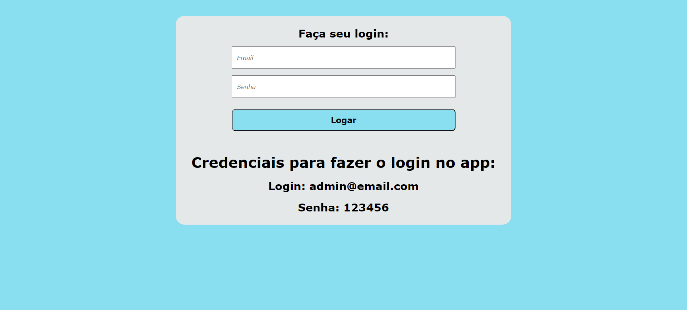
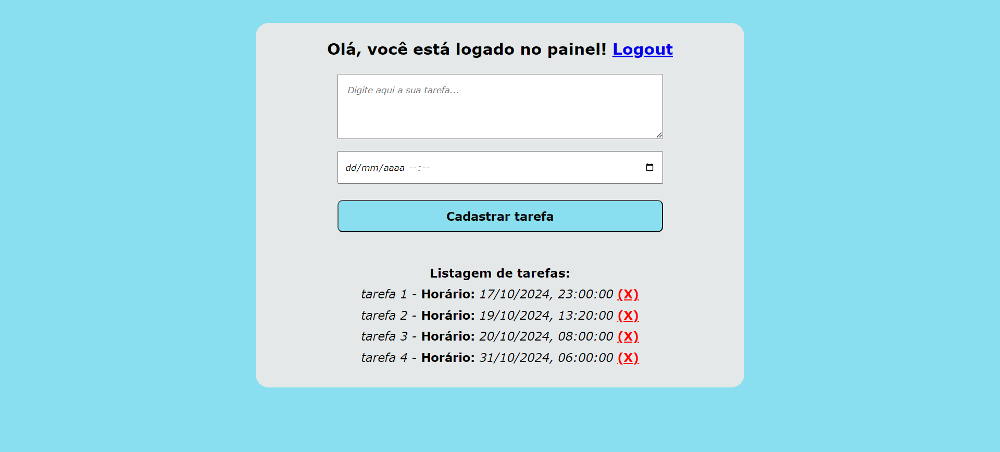

<h1>App Lista de Tarefas</h1>
 

Este projeto é um aplicativo de gerenciamento de tarefas totalmente funcional, desenvolvido utilizando HTML, CSS, JavaScript e Firebase. O app permite que os usuários façam login, adicionem tarefas, as visualizem em tempo real e as gerenciem de forma simples.

 
<h4>Principais Funcionalidades:</h4>

<li>Integração com Firebase: Utiliza o Firebase Firestore como banco de dados em tempo real, permitindo que os usuários adicionem, excluam e visualizem tarefas instantaneamente.</li>
   
<li>Persistência de Login: O app possui um sistema de persistência de login, onde os usuários permanecem logados mesmo se fecharem o navegador sem efetuar o logout. Ao reabrir o app, a sessão continuará ativa.</li>
   
<li>Atualizações em Tempo Real: A lista de tarefas é atualizada em tempo real, proporcionando uma experiência de usuário contínua.</li>
   
<li>Design Responsivo: Otimizado tanto para visualização em desktops quanto em dispositivos móveis.</li>  
   
<li>Ordenação de Tarefas: As tarefas são exibidas em ordem crescente, de acordo com o horário agendado.</li>  

 
<h4>Instruções de Uso:</h4>
<li>Faça login utilizando as credenciais fornecidas.</li>
 
<li>Adicione tarefas com uma descrição e um horário agendado.</li>
 
<li>Visualize a lista de tarefas e exclua-as conforme necessário.</li>
 
<h4>Tecnologias Utilizadas:</h4>
<li>Frontend: HTML5, CSS, JavaScript (ES6+)</li>
 
<li>Backend: Firebase Firestore (banco de dados em tempo real)</li>
 
<li>Autenticação: Firebase Authentication</li>
 
<h4>Objetivo do Projeto:</h4>

  O objetivo deste projeto fazer uma aplicação de lista de tarefas que utiliza o Firebase para banco de dados em tempo real. Ele conta com um sistema de persistência de login, onde, se o usuário fechar o navegador sem realizar o logout, ao reabrir o app, ele permanecerá logado. Além disso, o usuário pode adicionar, editar e excluir tarefas que ficam armazenadas no banco de dados em tempo real, garantindo que as informações sejam atualizadas instantaneamente.

Este foi o meu primeiro projeto utilizando o Firebase. Apesar de não ser muito complexo, foi uma ótima experiência para o meu aprendizado. Sinta-se à vontade para clonar, contribuir e explorar o projeto!

 

<h4>Pagina de login:</h4>

 
<h4>Painel de tarefas:</h4>

